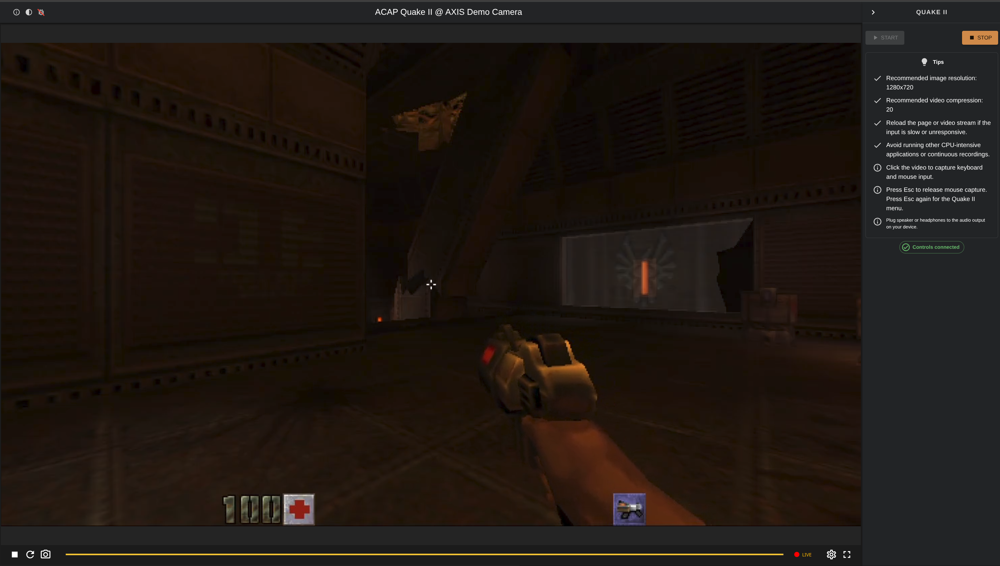

# ACAP Quake II

<table border="2" cellpadding="10" cellspacing="0" width="100%">
  <tr>
    <td align="center">
      <strong>⚠️ IMPORTANT ⚠️</strong><br/>
      This application is <strong>NOT affiliated</strong> with id Software LLC or Axis Communications AB.<br/>
      <strong>Please read and respect the LICENSE</strong> to ensure compliance.<br/>
      <strong>All assets, libraries, and tools are the properties of their respective owners.</strong><br/>
      <strong>FOR DEMO AND EDUCATIONAL PURPOSE ONLY</strong>
    </td>
  </tr>
</table>

<table border="2" cellpadding="10" cellspacing="0" width="100%">
  <tr>
    <td align="center">
      <strong>⚠️ UNOFFICIAL APP ⚠️</strong><br/>
      Install a signed ACAP package, or enable unsigned installation for development.<br/>
      Unsigned packages require <strong>Allow unsigned apps</strong> on AXIS OS 12.11,
      or <strong>Developer Mode</strong> on AXIS OS 13.
    </td>
  </tr>
</table>

<table border="2" cellpadding="10" cellspacing="0" width="100%">
  <tr>
    <td align="center">
      <strong>⚠️ IMPORTANT ⚠️</strong><br/>
      <strong>This application is NOT actively maintained.</strong><br/>
      It may not work on all devices or firmware versions.<br/>
      Requires AXIS OS firmware version <strong>12.11</strong> or later, and is validated up to AXIS OS <strong>13</strong>.
    </td>
  </tr>
</table>

## What is this?

[**Yamagi Quake II**](https://www.yamagi.org/quake2/) running as an ACAP application on Axis devices.

The project targets Axis devices based on **ARTPEC-8 and newer**.

Quake II is rendered with [OpenGL ES 3](https://www.khronos.org/opengles/) through [axoverlay2](https://developer.axis.com/acap/acap-native-sdk-version-12/api/src/api/axoverlay_v2/html/introduction.html)
and appears directly in the video stream.

For an explanation of browser input and rendering, see [docs/ARCHITECTURE.md](docs/ARCHITECTURE.md).

## Status

The game currently runs on Axis hardware with:

- Yamagi Quake II as the ACAP executable
- GPU rendering through EGL and OpenGL ES 3
- axoverlay2 output into the camera video stream
- Pinned Quake II demo data fetched during the build
- Included web interface with live video and browser controls

The web interface can start and stop the application, display the Axis video
stream, and capture keyboard and pointer-lock mouse input for Quake II.

## Build

Requirements:

- Git
- GNU Make
- Docker (or alternative container runtime)

Clone the repository and build the complete ACAP package:

```sh
git clone https://github.com/ErikMN/acap_quake2.git
cd acap_quake2
make acap
```

`make acap` initializes the pinned submodules, builds the ACAP SDK container image, builds all application dependencies,
and produces an installable `.eap` file in the repository root.

For build details, individual targets, and development workflows, see [docs/BUILD.md](docs/BUILD.md).

## Install

Install the generated ACAP package from the Axis device web interface under **Apps**, then start **ACAP Quake II**.

Starting the ACAP launches Quake II directly.

## Game data

Quake II game data is not stored in this repository.
The build downloads the Quake II 3.14 demo installer from the mirror documented by Yamagi Quake II,
verifies it, and packages the demo `pak0.pak` and `players/` data.

See [docs/THIRD_PARTY_DATA.md](docs/THIRD_PARTY_DATA.md) for source, checksum, and provenance information.

## FAQ

### Q: What is "ACAP"?

**A:** AXIS Camera Application Platform: An open application platform for software-based solutions built around Axis devices.
More info [here](https://www.axis.com/developer-community/open-source/acap).

### Q: Why can't I control the game?

**A:** Controls only work within the ACAP Quake II webpage.

### Q: Why are the controls slow or unresponsive?

**A:** There are a few steps you can take to improve the responsiveness of your game input:

1. **Try turning off other running ACAP applications.**
2. **Reload the video stream or the application UI.**
3. **Lower the stream resolution.**
4. **Ensure you are on the same network as your device for optimal performance.**

### Q: Why does it not work on my device?

**A:** Only tested on a limited set of ARTPEC-8 and ARTPEC-9 devices.

### Q: Which browsers are supported?

**A:** Tested on latest stable versions of Chrome and Firefox. Other browsers are unverified.

### Q: Why does it not install?

**A:** Install a [signed ACAP package](https://www.axis.com/support/acap-signing), or allow unsigned installation:

- On AXIS OS 12.11, enable **Allow unsigned apps** on the Apps page.
- On AXIS OS 13, unsigned installation requires [Developer Mode][developer-mode] for your device.

Also ensure that the application matches the device architecture.

[developer-mode]:
  https://developer.axis.com/acap/13-alpha/get-started/set-up-developer-environment/set-up-device-advanced/

### Q: Why am I not hearing any sounds?

**A:** You need to plug speakers or headphones to the audio output jack of your device.

### Q: Does it only work on devices with an ARTPEC chip?

**A:** Yes, it currently only works on devices based on ARTPEC-8 or newer ARTPEC SoCs.

### Q: What is the purpose of this?

**A:** This project is primarily a technical experiment demonstrating what is possible with the ACAP SDK.

## Screenshot



## License

This project is licensed under the GNU General Public License version 2.

Yamagi Quake II, SDL2, libwebsockets, and the Quake II demo data retain their respective copyright and license terms.
