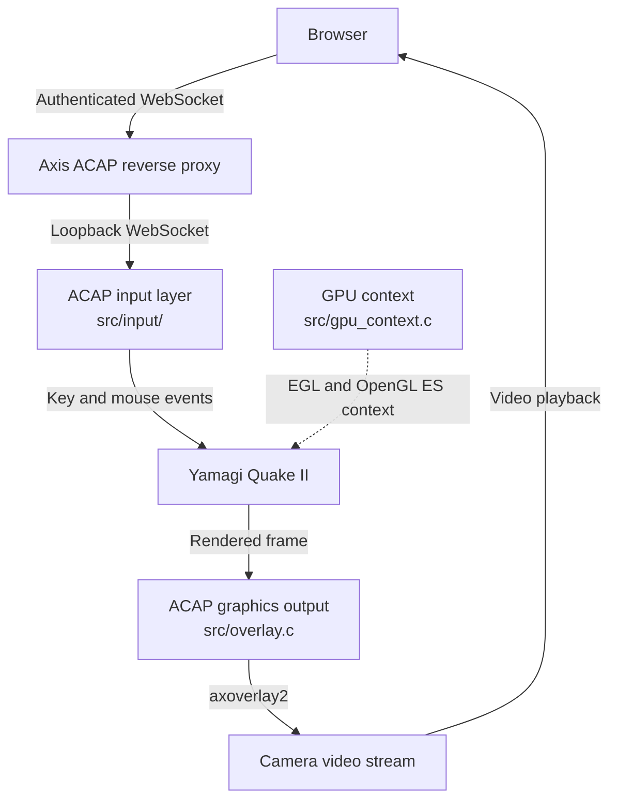
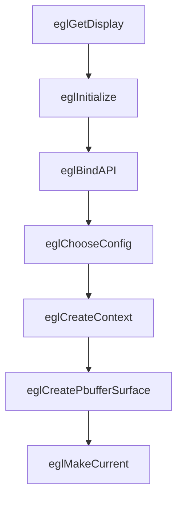
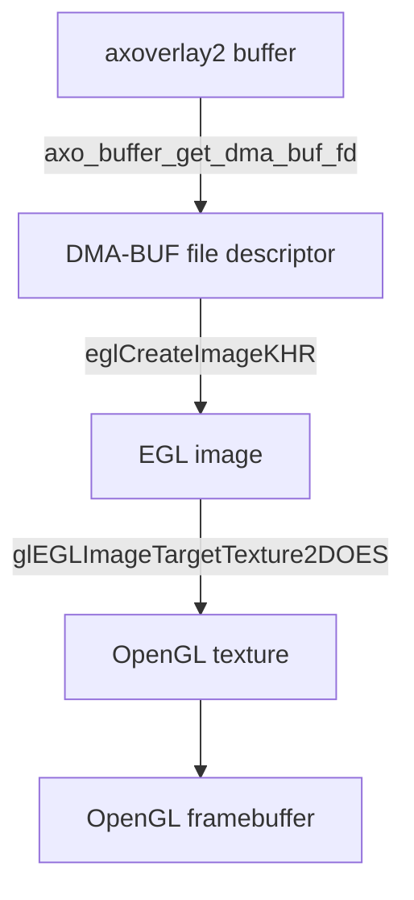
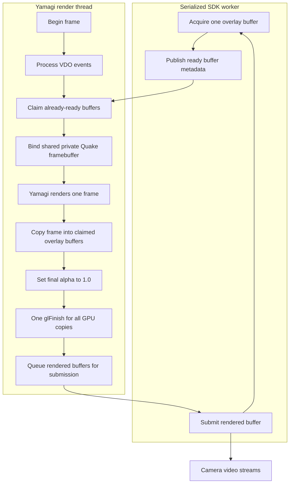
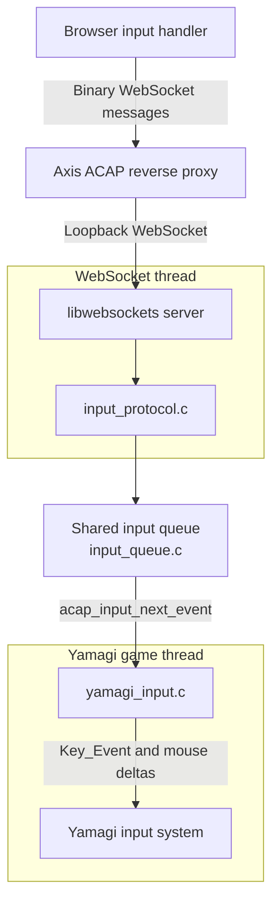

# ACAP Quake II Architecture

## Table of contents

- [ACAP Quake II Architecture](#acap-quake-ii-architecture)
  - [Table of contents](#table-of-contents)
  - [Purpose](#purpose)
  - [1. High-level architecture](#1-high-level-architecture)
    - [Browser video playback](#browser-video-playback)
  - [2. Yamagi integration](#2-yamagi-integration)
    - [Renderer hooks](#renderer-hooks)
  - [3. Graphics context](#3-graphics-context)
  - [4. Video stream and overlay setup](#4-video-stream-and-overlay-setup)
    - [Render size](#render-size)
  - [5. Private Quake framebuffer](#5-private-quake-framebuffer)
  - [6. Importing axoverlay2 buffers](#6-importing-axoverlay2-buffers)
  - [7. Frame lifecycle](#7-frame-lifecycle)
    - [Beginning the frame](#beginning-the-frame)
    - [Completing the frame](#completing-the-frame)
    - [Final alpha](#final-alpha)
    - [Synchronization](#synchronization)
  - [8. Input architecture](#8-input-architecture)
    - [Browser input handler](#browser-input-handler)
    - [WebSocket server](#websocket-server)
    - [Protocol decoder](#protocol-decoder)
      - [Wire format](#wire-format)
    - [Input queue](#input-queue)
    - [Yamagi input adapter](#yamagi-input-adapter)
  - [9. Runtime setup and audio](#9-runtime-setup-and-audio)
  - [10. Resource and thread ownership](#10-resource-and-thread-ownership)
  - [11. Where to look when debugging](#11-where-to-look-when-debugging)
  - [12. Recommended reading order](#12-recommended-reading-order)

## Purpose

ACAP (AXIS Camera Application Platform) lets applications run on Axis devices.
This guide follows browser controls into Quake II and rendered game frames back to the browser.

Start with the overview below. For rendering details, continue through sections 2 to 7.
For the control connection, jump to [Input architecture](#8-input-architecture).
The [reading order](#12-recommended-reading-order) points to the implementation when you want to explore the code.

Related documentation:

- [BUILD.md](BUILD.md) covers build, packaging, and target-side development.
- [THIRD_PARTY_DATA.md](THIRD_PARTY_DATA.md) explains where the packaged demo data comes from.

Yamagi Quake II remains the game engine.
It provides the game loop, game logic, input handling, audio handling, and GLES3 renderer.

The ACAP-specific code adapts the parts that do not map directly to the camera environment.
It provides an EGL and OpenGL ES context without a desktop window.
It sends rendered frames to a camera video stream through axoverlay2.
It receives keyboard and mouse input from the browser through the Axis ACAP WebSocket reverse proxy.

The port keeps these platform-specific changes outside Yamagi where practical.
The Yamagi patch contains the integration points that connect the engine to the ACAP-specific code.

## 1. High-level architecture

There are four main parts:

1. The browser plays the camera video stream and captures keyboard and mouse input.
2. The ACAP input layer receives browser input and converts it to events Yamagi understands.
3. Yamagi Quake II runs the game and renders each frame.
4. The ACAP graphics layer provides the GPU context and sends completed frames to the camera video stream.



[`gpu_context.c`](../src/gpu_context.c) sets up the graphics context before rendering starts.
[`overlay.c`](../src/overlay.c) manages the output buffers and submits completed frames to the video stream.

### Browser video playback

The Axis device serves the camera video stream containing the Quake overlay to the browser.
[`VideoPlayer.tsx`](../web/src/components/VideoPlayer.tsx) creates the player using the current page's host
and the saved video parameters. It passes these settings to
[`CustomPlayer.tsx`](../web/src/components/player/CustomPlayer.tsx), which uses `PlaybackArea`
from `media-stream-player` to display the stream.

When the page becomes hidden, the web player stops its video connection.
When the page becomes visible again, it explicitly refreshes `PlaybackArea` so a fresh stream connection is established
without requiring the user to press the Refresh button.

Video playback and game input use separate connections.
The browser sends controls through the ACAP `input` WebSocket endpoint
while the player receives the camera video stream.

## 2. Yamagi integration

The ACAP changes to Yamagi are stored in [yquake2-acap.patch](../patches/yquake2-acap.patch).
The client executable runs the game.
`ref_gles3.so` is the renderer library it loads.

The patch performs these main tasks:

1. Links the ACAP input objects into the Quake client.
2. Links `gpu_context.o` and `overlay.o` into `ref_gles3.so`.
3. Replaces SDL OpenGL context creation with `gpu_context_init()` for ACAP builds.
4. Redirects final framebuffer handling and frame presentation to `overlay.c`.
5. Starts and stops the ACAP input system from Yamagi's normal input lifecycle.
6. Adds ACAP-specific runtime defaults during startup.

The patch does not replace the Yamagi renderer.
It changes how the renderer obtains its graphics context and where its completed frame is presented.

### Renderer hooks

A framebuffer tells OpenGL which images to draw into.
The private Quake framebuffer holds the finished game image before it is copied into an overlay buffer.

The patch adds `GL3_BeginOutputFrame()`.
On ACAP it calls `overlay_context_begin_frame()`.

The patch also adds `GL3_BindOutputFramebuffer()`.
On ACAP it calls `overlay_context_bind_frame()`.
When an axoverlay2 output buffer is active, that function binds the private framebuffer owned by `overlay.c`.
Otherwise it binds framebuffer 0, the default framebuffer provided by the EGL surface.
A normal desktop build uses framebuffer 0 for the window.

Yamagi uses temporary framebuffers during rendering.
During an active ACAP output frame, Yamagi must return to the private Quake framebuffer instead of framebuffer 0.

The patch also changes `GL3_SwapWindow()`.
A normal build calls `SDL_GL_SwapWindow()`.
The ACAP build calls `overlay_context_end_frame()`.

## 3. Graphics context

[`src/gpu_context.c`](../src/gpu_context.c) creates the graphics context used by the renderer.
OpenGL ES provides drawing commands. The context stores the graphics state and objects those commands use.
EGL creates the context and connects it to the device graphics system.

A normal Yamagi desktop build lets SDL create an OpenGL context for a window.
The ACAP build creates its own graphics context with EGL.

It creates:

- an EGL display, which is a connection to the graphics system
- an OpenGL ES 3 context
- a 1x1 EGL pbuffer, a small drawing surface in memory

The 1x1 pbuffer is not the game image.
It gives EGL a valid surface so the OpenGL ES context can be made current, meaning active on the calling thread.
The image sent to the video stream is rendered into a framebuffer created by `overlay.c`.



`gpu_context_destroy()` releases the current context and destroys the pbuffer and context.
It then terminates the EGL display connection.

## 4. Video stream and overlay setup

`src/overlay.c` connects the completed Quake frame to a camera video stream.

The code uses three systems with separate roles:

- **VDO**, the Axis video API, reports when video streams appear or close.
- **[axoverlay2][axoverlay2-api]**, the Axis overlay API, provides image buffers
  and places their contents over a video stream.
- **EGL and OpenGL ES** let the GPU access and write those buffers.

`overlay_context_init()` starts axoverlay2.
It opens VDO stream 0 to receive overlay-related stream events, not to display the game on stream 0.
The renderer checks for existing, created, and closed streams during setup and at the start of each frame.

When an existing or newly created stream is reported, the code reads its stream ID, width, and height
and creates or updates a persistent stream record keyed by VDO stream ID.
The record is separate from the concrete axoverlay2 overlay and therefore survives temporary overlay failures.

Each record carries a monotonically changing **stream generation**.
A `CLOSED` event ends the current generation.
If the same stream ID later appears again, the new instance receives a newer generation.

Every blocking axoverlay2 operation captures the generation it started for.
When that operation returns, its result may change stream lifecycle state only if the captured generation is still current.
This establishes an explicit precedence rule: **newer VDO lifecycle events win over older SDK results**.
For example, a late `AXO_ERR_NO_STREAM` from an old acquisition cannot remove a stream which has already reopened.

Overlay creation also captures the stream dimensions it was requested for.
A creation result is accepted only if both the stream generation and requested dimensions still match.
If the same stream ID reports new dimensions while creation is running, the old overlay is discarded and the worker
immediately creates a replacement from the newest dimensions.

Concrete overlay creation is retried after a short delay when a stream-local failure occurs.
The browser does not need to reopen the stream to trigger that retry.

A stream can also close between a `CREATED` event and the subsequent VDO information lookup.
Expected stream-disappearance errors are handled locally instead of propagating into Yamagi's fatal renderer path.

Closed stream records are retained while an SDK operation, concrete overlay, outstanding buffer, or render-side cache
can still refer to them. Once all of that state is gone, the record is pruned.
This keeps stream ID reuse and stale asynchronous results unambiguous without accumulating inactive records indefinitely.

This follows the axoverlay2 lifecycle directly: each concrete overlay still belongs to one video stream,
while VDO events determine which stream instance is current.

### Render size

Each stream overlay chooses its own output size.

If both stream dimensions are divisible by two, that stream uses an overlay at half width and half height
with axoverlay2 2x upscaling. A 1920x1080 stream therefore uses a 960x540 overlay buffer.
If either dimension is not divisible by two, that stream uses the full stream size.

Quake itself still renders once per game frame.
The first successfully created concrete overlay selects the shared Quake render-target size.
After that, the render target stays at the same size while VDO still considers at least one stream present.
Temporary overlay removal and recreation therefore do not resize Quake's output.

Additional streams may use different overlay dimensions; the completed Quake image is scaled by the GPU
when it is copied into each stream overlay.

When VDO reports that no stream remains present, the shared render target is released.
The next stream that later appears can therefore select a new Quake render size.

Each stream record stores its used overlay width and height plus the full aligned axoverlay2 buffer dimensions.
The alignment padding satisfies buffer layout requirements and does not increase the visible image size.

## 5. Private Quake framebuffer

`create_render_target()` creates the framebuffer that Yamagi uses as its final ACAP render target.

It creates:

- an RGBA8 texture storing red, green, blue, and alpha, with 8 bits per component
- a renderbuffer storing depth for visibility tests and stencil values for masking drawing
- an OpenGL framebuffer attaching those images as its drawing destinations

During an active output frame, Yamagi places its final image in this private framebuffer.
It can use temporary framebuffers for intermediate rendering.

This gives Yamagi one stable final render target regardless of how many camera streams are active.
After Yamagi finishes the frame, the same completed color image is copied on the GPU into each active
stream overlay that has a free output buffer.

The [frame lifecycle](#7-frame-lifecycle) below shows the complete sequence.

## 6. Importing axoverlay2 buffers

The serialized SDK worker calls `axo_get_buffer()`.
When acquisition succeeds, it extracts the buffer ID and DMA-BUF descriptor while it is still the only thread
accessing axoverlay2, then publishes only that primitive metadata to the render thread.

`overlay_context_begin_frame()` never calls axoverlay2.
It consumes only buffers which are already marked ready by the SDK worker.

Each axoverlay2 buffer has a stable buffer ID within its concrete overlay.
`overlay.c` uses that ID together with the concrete-overlay epoch to decide whether the buffer has already been imported.

A new buffer is imported by `create_render_surface()`.



DMA-BUF is a Linux mechanism for sharing a memory buffer.
Its file descriptor lets EGL refer to the image memory provided by axoverlay2.
`eglCreateImageKHR()` creates an EGL image referring to that memory.

The import includes:

- the allocated width and height
- the DRM FourCC, a code identifying the pixel format
- the DMA-BUF file descriptor
- the plane offset, where the image data begins in the buffer
- the row pitch, the byte distance between rows in the logical image layout
- the DRM modifier, which describes details such as tiling or compression

`glEGLImageTargetTexture2DOES()` binds the imported EGL image to an OpenGL texture.
That texture is attached to an OpenGL framebuffer.

A `render_surface` stores these EGL and OpenGL objects, the buffer ID, and a depth and stencil renderbuffer.
The texture and EGL image refer to the same color buffer.
Importing it does not copy the completed game image.

Each stream overlay owns its own linked list of imported surfaces.
Buffer IDs identify buffers returned by a concrete overlay, so keeping the caches per stream makes the ownership explicit
and prevents a buffer ID from one overlay from being mistaken for a buffer belonging to another stream.
When axoverlay2 returns the same buffer for that stream again, the existing `render_surface` is reused.

## 7. Frame lifecycle

Acquisition and submission are asynchronous relative to the game frame.
The render thread consumes buffers which the SDK worker acquired earlier, then hands completed buffers back to that worker:



### Beginning the frame

Axoverlay2 defines `axo_get_buffer()` as a blocking synchronous call with a platform-dependent timeout.
The SDK implementation also uses process-wide request and bookkeeping state, so this application does not call
axoverlay2 concurrently from multiple threads.

Instead, one **serialized SDK worker** owns all runtime axoverlay2 operations:

- concrete overlay creation and removal
- buffer acquisition
- buffer metadata queries
- buffer submission

The worker processes only one SDK call at a time.
This avoids races in shared library state and prevents one operation from consuming another operation's reply.

A blocking acquisition can still delay later axoverlay2 work queued behind it; the API provides no readiness or
caller-selected nonblocking mode to avoid that safely in one process.
Because submission uses the same serialized worker, this can also postpone presentation of already rendered frames
for other streams until the blocking acquisition returns. Independent animation progress across mixed-frame-rate
streams is therefore not guaranteed by this design.

The important boundary is that this delay never blocks the Yamagi game/render thread.
Quake continues running internally and skips streams which do not already have a ready buffer.

Acquisition attempts use round-robin ordering so a stream which returns `AXO_ERR_WAIT` moves behind the other
eligible streams rather than being selected repeatedly before they get a turn.

`overlay_context_begin_frame()` first processes pending VDO events and wakes the SDK worker.
It then synchronizes render-side buffer caches with the current concrete-overlay epochs and polls for buffers
which the worker has already marked ready.

A ready buffer is claimed only while its concrete overlay is not owned by an active SDK action and no recreation
has been requested. Once removal or recreation has been selected, the old buffer cannot cross into EGL import.

For each accepted ready buffer, `create_render_surface()` imports the published DMA-BUF metadata into EGL on the render thread.
No axoverlay2 call occurs during EGL import.

If DMA-BUF import fails, the acquired buffer is never submitted.
Submitting normally presents a buffer, so an undrawn buffer must not be returned through `axo_submit_buffer()`.
The buffer is instead marked for discard, the concrete overlay is removed by the SDK worker, and creation is retried.

If at least one stream has a valid output buffer, the shared private Quake framebuffer is bound and Yamagi renders once.
If no stream has a ready buffer for that frame, Yamagi continues running but there is nothing to copy.

### Completing the frame

`overlay_context_end_frame()` first checks whether any stream has an acquired buffer and imported surface.
If none do, there is no output buffer to submit for that frame.

When one or more output buffers exist, the code binds the private Quake framebuffer as
`GL_READ_FRAMEBUFFER` and visits each acquired stream buffer as `GL_DRAW_FRAMEBUFFER`.

`glBlitFramebuffer()` copies the same completed Quake image into every stream buffer.
The destination coordinates also scale the image to that stream overlay's dimensions and reverse the Y axis.

The code does not use `glReadPixels()` or a CPU-side copy for the completed frame.

### Final alpha

Alpha controls how much of the underlying video shows through: 0.0 is transparent and 1.0 is opaque.
Quake's render target can contain non-opaque alpha values after normal rendering.
The final axoverlay2 image is forced opaque so the camera video does not show through the game image.

After the framebuffer copy, the code enables writes only to the alpha channel.
It clears alpha to 1.0 and then restores normal color writes.

### Synchronization

The overlay enables manual DMA synchronization with `axo_props_set_manual_dma_sync(props, true)`.
This makes the application responsible for completing its GPU writes before returning a buffer.

After all stream buffers have received the completed image, one `glFinish()` waits for all GPU writes.
The render thread then changes those buffers from the rendering state to the submit state and wakes the SDK worker.

Only the SDK worker calls `axo_submit_buffer()`.
After a successful submission the buffer becomes free and that stream becomes eligible for another acquisition attempt.

If submission reports that the stream disappeared, that result is applied only when its captured stream generation is
still current. Other submission failures request recreation of that concrete overlay.

Using one GPU synchronization point avoids waiting separately for every active stream, while serialized SDK submission
keeps axoverlay2's process-wide state single-threaded.

## 8. Input architecture

A WebSocket keeps a connection open so the browser can send controls as they happen.
Inside the ACAP process, two threads share this work: one handles the connection, and one runs the game.

The WebSocket server runs on its own thread.
Yamagi consumes the queued input from its normal game thread during `IN_Update()`.



The input queue is the handoff between the two threads.
The WebSocket thread does not call Yamagi input functions directly.

### Browser input handler

[`App.tsx`](../web/src/components/App.tsx) opens the control connection and retries two seconds after it closes.
[`getBackendWebSocketUrl.ts`](../web/src/components/getBackendWebSocketUrl.ts) builds `/local/acap_quake2/input`
on the current page's host. It uses `wss` for an HTTPS page and `ws` for an HTTP page.

[`QuakeInputHandler.tsx`](../web/src/components/QuakeInputHandler.tsx) captures keys, mouse movement,
buttons, and wheel input. It sends the small binary messages described in the wire format below.

Clicking the game area focuses it and requests pointer lock, which captures the mouse for relative movement.
This lets the player keep turning without the cursor reaching the edge of the screen.
Mouse movement, buttons, and wheel input are sent while pointer lock is active.
Keyboard input is accepted while the game area has pointer lock or keyboard focus.
The handler uses `KeyboardEvent.code`, so keys represent physical positions rather than typed characters.
It sends messages only while the WebSocket is open.
Controls used while disconnected are not saved for later.

A reset asks the game to release held controls, for example when a key release is missed after switching tabs.
The browser sends it when pointer lock is lost after capture, the window loses focus, or the page becomes hidden.

### WebSocket server

The Axis web server authenticates the browser and forwards its control connection to the app.
This forwarding is the reverse proxy: the browser uses the device web address while the app listens locally.
[`manifest.json`](../manifest.json) maps the `input` path to `ws://127.0.0.1:9000` and requires `admin` access.
[`websocket.c`](../src/input/websocket.c) runs libwebsockets on its own thread and listens on loopback,
which is reachable only from within the device.

The callback accepts complete binary messages.
Non-binary messages and fragmented messages are ignored.

Connection, disconnection, and message events are passed to callbacks registered by `acap_input.c`.

### Protocol decoder

[`input_protocol.c`](../src/input/input_protocol.c) checks each packet and produces an `acap_input_event`
for valid input. Invalid packets are discarded.

It checks:

- protocol version
- message type and packet length
- key code range
- button range
- pressed or released values where applicable

#### Wire format

Protocol version 1 uses byte 0 for the protocol version and byte 1 for the message type.
Each table entry lists the bytes of one complete message.
Multi-byte integers use little-endian byte order: the low byte comes before the high byte.

| Message | Type | Bytes |
| --- | ---: | --- |
| Key | 1 | `version, type, key_lo, key_hi, down` |
| Mouse motion | 2 | `version, type, dx_lo, dx_hi, dy_lo, dy_hi` |
| Mouse button | 3 | `version, type, button, down` |
| Wheel | 4 | `version, type, x, y` |
| Reset | 5 | `version, type` |

`down` must be 0 or 1. Mouse deltas are signed 16-bit integers. Wheel values are signed 8-bit integers.
The browser normalizes each wheel axis to -1, 0, or 1 before sending it.
The Yamagi adapter currently uses only vertical wheel value `y`.
Horizontal `x` is decoded but ignored.

For example, pressing physical key `KeyW` sends the decimal bytes `1, 1, 23, 0, 1`.
These mean protocol version 1, key message, key ID 23, and pressed. Releasing it changes the last byte to 0.

Key identifiers are defined by `enum acap_key_code` in [`input_queue.h`](../src/input/input_queue.h).
They represent physical browser controls and are translated to Yamagi key values on the game thread.

Mouse button identifiers match the `MouseEvent.button` values supported by the frontend:

- 0: left
- 1: middle
- 2: right
- 3: back
- 4: forward

### Input queue

[`input_queue.c`](../src/input/input_queue.c) holds up to 256 events in arrival order.
A mutex, a lock shared by both threads, prevents them from changing the queue at the same time.
The WebSocket thread adds events, and the game thread removes them in the same order.

If the queue is full, [`acap_input.c`](../src/input/acap_input.c) discards the queued events
and the event that could not fit, then inserts a reset.
It also queues a reset when a client connects or disconnects.
There is one shared queue and one set of held controls: all connected browsers control the same game.

### Yamagi input adapter

[`yamagi_input.c`](../src/input/yamagi_input.c) translates queued ACAP events into Yamagi input.

It maps:

- letters and digits to their character values
- special keys to Yamagi key constants
- mouse buttons to `K_MOUSE1` through `K_MOUSE5`
- vertical wheel movement to `K_MWHEELUP` or `K_MWHEELDOWN`

Relative mouse movement is added to Yamagi's `mouse_x` and `mouse_y` values
only while input is directed to gameplay and the game is not paused.
Mouse movement is discarded while input is directed to menus or the console.

A wheel event is sent to Yamagi as an immediate key press followed by a key release.

`config/autoexec.cfg` binds the wheel keys to Yamagi's normal weapon commands:

```cfg
bind MWHEELDOWN weapprev
bind MWHEELUP weapnext
```

The same binding system turns the `KeyW` example into forward movement: the adapter produces a `w` key event,
and `config/autoexec.cfg` binds `w` to `+forward`.
The input protocol sends controls, and Yamagi decides their actions.

For reset events, `yamagi_input.c` releases the keys and mouse buttons it tracks.
It then calls `Key_MarkAllUp()` and clears accumulated mouse movement.

## 9. Runtime setup and audio

The patch adds ACAP-specific startup defaults in Yamagi's `src/backends/unix/main.c`.

It adds these command-line arguments before any user-supplied arguments:

- `-datadir` with the package binary directory
- `+set vid_ref gles3`
- `+set vid_fullscreen 0`
- `+set r_msaa_samples 0`
- `+set r_vsync 0`
- `+newgame`

It creates `localdata` inside the package directory and assigns that path to `HOME`.

It also sets:

- `SDL_VIDEODRIVER=dummy`
- `SDL_AUDIODRIVER=pipewire`
- `PIPEWIRE_NODE=AudioDevice0Output0` if `PIPEWIRE_NODE` is not already set

The process then changes its working directory to the package binary directory.

SDL remains part of Yamagi.
For the ACAP build, EGL replaces SDL as the source of the OpenGL context.
SDL audio uses PipeWire to send game sound to an output on the device.
See [Audio playback](BUILD.md#audio-playback) for output selection and permissions.

## 10. Resource and thread ownership

Here, ownership means responsibility for keeping a resource valid and releasing it when finished.

- `gpu_context` owns the EGL display, OpenGL ES context, and 1x1 pbuffer.
- `overlay_context` owns the VDO event stream, the shared Quake render target, the persistent stream records, and one serialized axoverlay2 worker.
- Each `overlay_stream` owns the lifecycle state for one VDO stream ID and the render-side cache for its current concrete overlay.
- The serialized SDK worker is the only thread which performs runtime axoverlay2 create, remove, acquire, metadata, and submit operations.
- The Yamagi render thread owns all EGL and OpenGL work and never waits for axoverlay2.
- Stream generations make VDO lifecycle events authoritative over stale results from older SDK operations.
- `render_surface` owns the EGL and OpenGL objects created for one imported DMA-BUF.
- The WebSocket thread owns network servicing and produces decoded input events.
- The input queue transfers events from the WebSocket thread to the Yamagi game thread.
- The Yamagi game thread consumes ACAP input and runs the renderer calls that use the ACAP graphics path.

Shutdown stops the WebSocket thread before destroying the input queue.
The renderer releases overlay graphics resources before destroying the EGL context they depend on.

## 11. Where to look when debugging

- For EGL or OpenGL context setup, start with `src/gpu_context.c`.
- For VDO stream discovery, stream-generation handling, or overlay retries, start with `src/overlay.c`.
- For SDK serialization or a stream delaying buffer acquisition, inspect `overlay_sdk_worker()` and `select_overlay_sdk_action_locked()`.
- For acquisition-specific behavior, inspect `perform_overlay_acquire()`.
- For buffer import, frame copy, alpha handling, or asynchronous submission, start with `src/overlay.c`.
- For WebSocket reception, start with `src/input/websocket.c`.
- For rejected input packets, start with `src/input/input_protocol.c`.
- For queue ordering or overflow behavior, start with `src/input/input_queue.c` and `src/input/acap_input.c`.
- For incorrect Quake key or mouse behavior, start with `src/input/yamagi_input.c`.
- For mouse wheel weapon bindings, start with `config/autoexec.cfg`.

`overlay_context_render_frame()` is a test helper that draws a changing red and green image through the overlay path.
The Yamagi renderer does not call it. It is compiled into the renderer but is not a selectable game mode.

## 12. Recommended reading order

For the graphics path:

1. `src/gpu_context.h`
2. `src/gpu_context.c`
3. `src/overlay.h`
4. `overlay_context_init()`
5. `overlay_context_process_events()` and `register_overlay_stream()`
6. `overlay_sdk_worker()` and `select_overlay_sdk_action_locked()`
7. `perform_overlay_create()`, `perform_overlay_acquire()`, and `perform_overlay_submit()`
8. `sync_render_resources()`
9. `create_render_target()`
10. `overlay_context_begin_frame()`
11. `create_render_surface()`
12. `overlay_context_end_frame()`
13. The graphics-related parts of `patches/yquake2-acap.patch`

For the input path:

1. `manifest.json` for the reverse-proxy endpoint
2. `web/src/components/getBackendWebSocketUrl.ts`
3. `web/src/components/QuakeInputHandler.tsx`
4. `src/input/input_protocol.h` and `src/input/input_protocol.c`
5. `src/input/websocket.c`
6. `src/input/acap_input.c`
7. `src/input/input_queue.h` and `src/input/input_queue.c`
8. `src/input/yamagi_input.c`
9. The input-related parts of `patches/yquake2-acap.patch`

Read the patch after the custom source files.
Most patch changes are easier to understand once the functions they call are already familiar.

[axoverlay2-api]: https://developer.axis.com/acap/acap-native-sdk-version-12/api/src/api/axoverlay_v2/html/index.html
